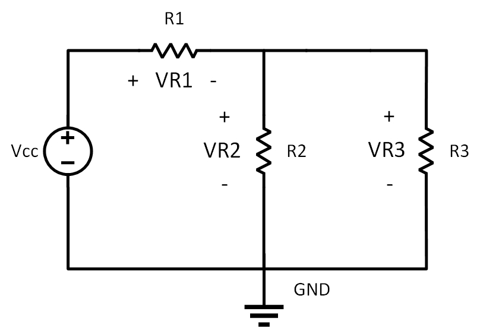
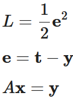
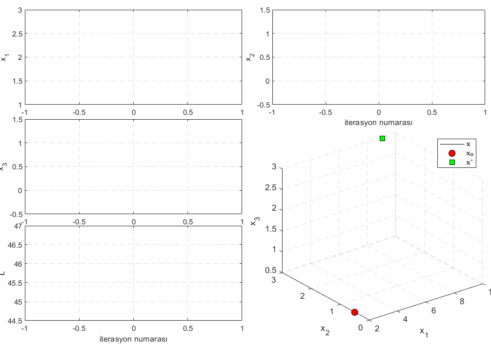
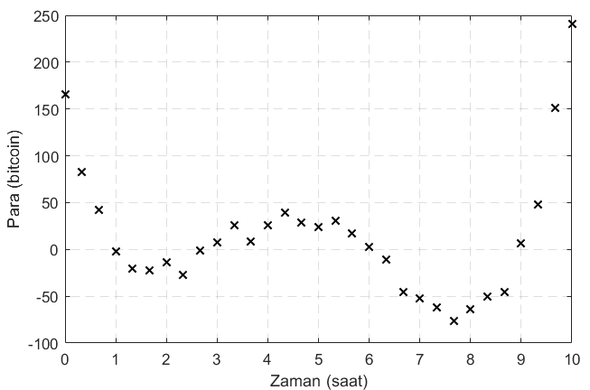

# EESEC 222/312
Merhaba arkadaşlar. Bu sayfada **EESEC 222/312 Sayısal Çözümleme** ders notlarına, derste yazdığımız **MATLAB** ve **Python** kodlarına ve sunumlara yukarıda gördüğünüz dosyalardan ulaşabilirsiniz. Derste işlediklerimizin özetini ve ilgili videoları aşağıda bulabilirsiniz. 

## 1. Hafta
Dilimize yabancı kaynaklardan girmiş **vasat** kelimesi üzerinden **optimizasyon** kavramına genel bir giriş yaptık. Aşağıda *Şekil 1*'de tahtanın sol tarafında çizilen grafikte elimizdeki model **y** = a**x** ve verilere (**x**,**y**) göre a parametresinin **optimal** (veya **optimum**) değerine a<sup>*</sup> denildiğini gördük. Burada **ekstrem** değerler olarak isimlendirilen a<sub>min</sub> ve a<sub>max</sub> uç değerleri temsil ediyorlardı.

Optimizasyonun insanın hayatında da çok önemli bir yere sahip olduğunu *Şekil 1*'deki tahta ders notumuzda sağ tarafta **akıl** kavramı üzerinden verdiğimiz örnekle gördük. Burada aklı hiç kullanmama (minimum) ve en üst düzeyde kullanma (maximum) uç durumlarına ve de bu soyut kavramın optimal değeri gibi isimlendirilebilecek **wisdom** noktasına baktık.

</br>
*Şekil 1*: İlk hafta tahtaya yazdığımız ders notu.

## 2. Hafta
Bu hafta aşağıda şeması verilen devrede V<sub>cc</sub>, R<sub>1</sub>, R<sub>2</sub> ve R<sub>3</sub> değerlerini bildiğimiz varsayarak V<sub>R<sub>1</sub></sub>, V<sub>R<sub>2</sub></sub> ve V<sub>R<sub>3</sub></sub> voltajlarını bulmak istiyoruz. Tabi 1/R<sub>eş</sub> = 1/R<sub>2</sub>+1/R<sub>3</sub> formülüyle R<sub>2</sub> ve R<sub>3</sub> dirençlerinin eşdeğer direnci bulunabilir ve gerilim bölücü (İng. voltage divider) devre mantığı kullanılarak her bir direncin üzerine düşen voltaj kolaylıkla hesaplanabilir. Ancak biz burada devreye Kirchoff'un voltaj ve akım yasalarını uygulayarak denklemler elde edip bu denklemleri doğrusal cebir dersinde öğrendiğimiz matris ve vektör gösterimlerini kullanarak çözmek istiyoruz. Bu şekilde formülle elde edilebilen çözümlere **analitik çözüm** dendiğini derste söylemiştik. Eğer formülle çözümü bir seferde elde edemiyor olsaydık o zaman **nümerik çözüm** metodlarından birisini kullanarak adım adım çözüme ulaşmaya çalışacaktık.

### Kirchoff Kanunları ile Devre Analizi Örneği



Kirchoff'un voltaj ve akım kanunlarını devreye uygulayarsak aşağıdaki doğrusal denklemleri elde ederiz.


Bu doğrusal denklem sistemini matris eşitliği haline getirelim.


Soldaki 3x3'lük matrisi A, aradığımız voltaj değerlerinden oluşan vektörü **x** ve eşitliğin sağ tarafındaki vektörü **y** olarak tanımlarsak o zaman denklem A**x**=**y** haline gelir. 

#### Analitik Çözüm
Doğrusal cebirde bu denklemin çözümünü denklemin her iki tarafını soldan A matrisinin tersi ile çarparak elde ederiz.

A<sup>-1</sup>A**x** = A<sup>-1</sup>**y**

Bu işlem de bize 

**x** = A<sup>-1</sup>**y**

çözümünü verir. Bu çözümü R<sub>1</sub> = 9Ω, R<sub>1</sub> = 4Ω, R<sub>1</sub> = 12Ω ve V<sub>cc</sub>=12V değerleri için bize **x**<sup>*</sup> ≜ (V<sup>*</sup><sub>R<sub>1</sub></sub>, V<sup>*</sup><sub>R<sub>2</sub></sub>, V<sup>*</sup><sub>R<sub>3</sub></sub>) = (9,3,3) olarak hesaplayan **MATLAB** kodu

```
R1 = 9; R2 = 4; R3 = 12; Vcc = 12;
A = [1 1 0; 0 -1 1; 0 (1/R1+1/R2+1/R3) 0]
y = [Vcc; 0; Vcc/R1]
x = inv(A)*b
```

**Python** kodu ise 

```
import numpy as np
R1 = 9
R2 = 4
R3 = 12
Vcc = 12
A = np.matrix([[1,1,0],[0,-1,1],[0,1/R1+1/R2+1/R3,0]])
y = np.array([[Vcc],[0],[Vcc/R1]])
x = A.getI()*y
```

olarak yazılabilir. Bu kodlara yukarıda **code** olarak isimlendirilmiş dizinden ulaşabilirsiniz. Sunum üzerinden problemi anlamak ve MATLAB ve Python çözümlerini izlemek isterseniz aşağıdaki resme tıklayın.

[](https://youtu.be/69PK49Cq41w)

## 3. Hafta
### Kirchoff Kanunları ile Devre Analizi Örneği - devam
Bu hafta ikinci hafta üzerinde durduğumuz rezistif devrede elde ettiğimiz **x**<sup>*</sup> ≜ (V<sup>*</sup><sub>R<sub>1</sub></sub>, V<sup>*</sup><sub>R<sub>2</sub></sub>, V<sup>*</sup><sub>R<sub>3</sub></sub>) = (9,3,3) çözümünü bu sefer analitik olarak değil de **nümerik** (yani **sayısal**) olarak elde etmeye çalışacağız. Geçen hafta doğrusal cebir bilgilerimizi kullanarak elde ettiğimiz

A**x** = **y**

eşitliğini aynen burada da kullanacağız (sadece **y** yerine **target** kelimesinin baş harfi olan **t** değişikliğini yapacağız - **y** değişkeni **x** vektörünün o andaki değerine göre modelimizin çıkışı olan A**x** olacak ki bu değişikliği aşağıda hem yazıda hem videoda açıklayacağız). Burada çözüm olarak aradığımız değerler olan V<sub>R<sub>1</sub></sub>, V<sub>R<sub>2</sub></sub> ve V<sub>R<sub>3</sub></sub> voltajlarını tek hamlede değil de **iterasyon**larla yani **nümerik** olarak elde etmeye çalışacağız. 
#### Nümerik Çözüm
Diğer çoğu nümerik yaklaşımda olduğu gibi Kayıp Fonksiyonu (İng. Loss Function) denilen bir fonksiyon tanımlayıp bu fonksiyonu minimize edeceğiz. Aynı zamanda Maliyet Fonksiyonu (İng. Cost Function) olarak da bilinen kayıp fonksiyonu, tasarladığımız formülle adım adım minimize edilebilirse o zaman bizim çözüm olarak aradığımız değerler/parametreler optimize olur. İterasyonların bir şekilde sonlanmasıyla adım adım güncellediğimiz değerler de son halini almış olur. Aşağıda verilen blok diyagram kabaca bu süreci anlatmaktadır.

</br>
*Şekil 2*: Devre analizi örneği nümerik çözüm blok diyagramı.

Şekilde A ve **t** sabit ve bildiğimiz değerler. Optimal değerini aradığımız **x** için ister kendimizin belirlediği ister de rasgele (İng. random) olan bir başlangıç koşulu (İng. initial condition) **x<sub>0</sub>** belirlememiz gerekecek. Genelde optimizasyon problemlerinde parametrelerin ilk değerleri olan başlangıç koşulları rasgele belirlenir. Belirlenen başlangıç koşulu **x<sub>0</sub>** doğal olarak **x<sup>*</sup>**'a eşit olmayacağı için en başta **y** vektörü **t**'ye eşit olmayacaktır ve dolayısıyla hata vektörü **e** ≜ **t**−**y** sıfırdan farklı elemanlara sahip olacaktır. Burada optimize etmeye çalıştığımız değerlerde gözlemlenen hataların her biri hata vektörünün elemanlarıdır. Yani 


ve 


olarak verilirse o zaman hata vektörü 


olmuş olur. Burada hata vektörünün bütün elemanlarını ayrı ayrı sıfırlamaya çalışırsak o zaman eleman sayısı kadar kayıp fonksiyonu tanımlamış oluruz. Bunun yerine kayıp fonksiyonunu hataların toplamı olarak tanımlarsak o zaman tek bir fonksiyonla işimizi görmüş oluruz fakat derste de üzerinde durduğumuz gibi bazen bazı hatalar birbirlerini sıfırlayabilir ve bizi yanıltabilir. Mesela, bildiğimiz gibi 


olarak analitik çözümle bulunmuştu. Nümerik çözümde daha iterasyonlara bile başlamadan başlangıç koşulunu **x<sub>0</sub>**=(7,5,3) olarak seçsek o zaman **e<sub>0</sub>**=(2,−2,0) olur ki bu durumda hataların toplamı sıfır olmuş olur. O zaman hata sıfır yani **t**=**y** durumu olur ve sanki optimal değerleri elde etmiş gibi işlemleri durdururduk. Ancak biliyoruz ki burada birinci hata ikincisini bizi yanıltacak bir biçimde sıfırlamış oldu. İşte bu yüzden kayıp fonksiyonunu hataların toplamı yerine hataların karelerinin toplamı olacak şekilde tanımlamak hataların birbirini götürüp bizi yanıltmasını engelleyecektir. Aynı zamanda kayıp fonksiyonunu tek bir fonksiyon olarak tanımlanabilecektir. Böylece hataların karelerini minimize etmeye çalışacağız ki buna **en küçük kareler** (İng. least squares) yaklaşımı denmektedir. Böylece kayıp fonksiyonu 


haline gelir (burada n=3). Aynı ifade olmasa da vektör formatında 


olarak gösterilebilir. Burada hatanın karesinin önüne 1/2 katsayısını koymamızın sebebi derste de bahsettiğimiz gibi nümerik çözüm formüllerini türetirken kayıp fonksiyonunun türevini alacak olmamız. Bu şekilde daha sade ifadelerle karşılaşmış olacağız. Bu şekilde daha sade ifadelerle karşılaşmış olacağız. Özetlemek gerekirse 

A**x** = **y**

**e** = **t**-**y**

L = 1/2**e<sup>2</sup>**

ifadelerini elde ettik. Bu formülasyonu kullanarak yukarıda şekilde görüldüğü gibi **x** değerlerini güncelleyecek **Δx** adımını hesaplayıp **x**'e ekleyeceğiz.

**x<sub>k+1</sub>** = **x<sub>k</sub>** + **Δx<sub>k</sub>**

Burada **k** fihristi iterasyon numarasını gösteriyor. Şu anda yapmak istediğimiz şey her adımda **x<sub>k</sub>** değerini **x<sup>*</sup>**'a yaklaştıracak **Δx<sub>k</sub>**'yı hesaplamak.

#### Eğim Düşümü (Gradient Descent) Metodu
Kayıp fonksiyonunu optimal değerlerini aradığımız değişken **x** cinsinden yazacak olursak 

L = 1/2(**t**-A**x**)<sup>2</sup>

olur ki bu ifade de ikinci dereceden bir denklemdir (yani bir paraboldür). Kayıp fonksiyonunu kabaca çizecek olursak **Şekil 4**'deki gibi olacaktır.

</br>
*Şekil 4*: Kayıp fonksiyonu.

Herhangi bir **x<sub>k</sub>** değeri için bu fonksiyonun üzerinde olduğumuzu düşünün. Değişimi temsil eden ∂L/∂**x<sub>k</sub>** ifadesi sağ tarafta pozitif, sol tarafta ise negatiftir. Bizim amacımız her adımda **x**'i güncelleyerek L'yi minimize etmek. Soldayken (yani **x**<**0** durumunda) ∂L/∂**x<sub>k</sub>** ifadesi negatif, dolayısıyla sağa doğru hareket edilmeli ki L<sub>k+1</sub><L<sub>k</sub> olsun. Benzer bir biçimde, sağdayken ∂L/∂**x<sub>k</sub>** > 0. Yine ∂L/∂**x<sub>k</sub>**'in işaretinin ters yönünde güncellemeyi yapacağız. Yani bu sefer de sola doğru gideceğiz ki yine L<sub>k+1</sub><L<sub>k</sub> olsun. 

#### Adım Boyu (Step Size) Seçimi
Güncellemenin yönünü doğru belirledik ama adım boyunu da belirlememiz gerekir. Adım boyu dediğimiz α parametresi genelde 0<α<1 aralığında seçilir. Eğer adımlarımızı çok büyük seçersek optimal değerlerin üzerinden atlayabiliriz ve ihtimal hiç bir zaman **x<sup>∗</sup>**'a yakınsamayabiliriz. Çok da küçük seçersek bu sefer de optimizasyon iterasyon sayısı bakımından uzun sürer. Sonuç olarak güncelleme ifadesi aşağıdaki halini alır.

**x<sub>k+1</sub>**=**x<sub>k</sub>**+**Δx<sub>k</sub>**

Burada **Δx<sub>k</sub>**'i yerine koyarsak


olur. Daha önceden Kayıp fonksiyonu L'yi hata **e** cinsinden, hata **e**'yi de **y** cinsinden aşağıdaki gibi tanımlamıştık.



Bu halde güncelleme ifadesinde zincir kuralını uygularsak 


Burada alt fihrist *k* sırasıyla kayıp fonksiyonu, hata, çıkış ve aranan değerlerin o andaki değerlerine işaret etmektedir. Elde edilen son ifadede kısmi türev içeren terimleri hesaplayalım.


Türettiğimiz sonuçları Eğim Düşümü metodu ile elde ettiğimiz güncelleme formülünde yerine koyarsak güncelleme ifadesi devre analizi örneğinin nümerik çözümü için 


halini alır. Burada **e**'nin yerine **t**−A**x** koyup ifadeyi matris çarpımları doğru olacak şekilde düzenlersek 


ifadesine ulaşmış oluruz. Elde ettiğimiz bu formülü 


olacak şekilde **MATLAB**'da koşturursak aşağıdaki grafiği elde ederiz.

</br>
*Şekil 4*: Devre analizi örneği MATLAB'da gerçeklenmiş optimizasyon sonucu elde edilen grafik.

</br>
*Şekil 5*: Devre analizi örneği MATLAB'da gerçeklenmiş optimizasyon animasyonu.

##### MATLAB kodu
```
clear all; close all; clc;
R1 = 9; R2 = 4; R3 = 12; Vcc = 12;
A = [1 1 0; 0 -1 1; 0 (1/R1+1/R2+1/R3) 0];
t = [Vcc; 0; Vcc/R1];
x0 = [2; 0.5; 0.5];
n = 100;
x = zeros(3, n+1);
x(:,1) = x0;
L = zeros(1, n+1);
alpha = 0.5;
L(:,1) = 0.5*sum((t-A*x(:,1)).^2);
for i=1:n
    x(:,i+1) = x(:,i) + alpha*A*(t-A*x(:,i));
    L(:,i+1) = 0.5*sum((t-A*x(:,i)).^2);
end
```
Yukarıda verilen kodda grafik çizdirme ve animasyon kısmı yok. Grafiği çizdiren ve video/gif dosyalarını üreten kod için yukarıda **code** isimli dizine gidin ve ilgili MATLAB kodunu gerekli Boolean değişkenlerini **true** veya **false** yaparak koşturun. 

Bu hafta tahtaya yazdığımız notları *Şekil 6*'de görebilirsiniz.
<p align="center"></p>

*Şekil 6*: Üçüncü hafta tahtaya yazdığımız ders notu.

# 4. Hafta
Bu hafta geçen hafta devam ettiğimiz devre analizi örneğinin nümerik çözümünün bilgisayarda MATLAB ile çözdürülmesini gördük. İlgili video aşağıdaki resme tıklanınca izlenebilir.

[](https://youtu.be/1PqLf-5npC0)

# 5-6-7. Haftalar
Örnek bir 1-boyutlu optimizasyon problemi üzerinde durduk [1]. Şimdi burada ara sınavda karşımıza bir benzeri çıkabilecek örnek bir optimizasyon problemine bakacağız.

### Ara sınava yönelik örnek soru
Mahfoud bit coin'e yatırım yapıp oradan para kazanan bir arkadaşımız. Kullandığı bit coin uygulamasında son 10 saat için her 20 dakikada bir örnek (İng. sample) yakalayan bir Python programı yazıyor ve bu programı koşturmasıyla elde ettiği veriye ilk önce bir model öngörüp (İng. prediction) ardından bu modeli optimize etmek ve duruma göre para yatırıp kârını artırmak istiyor. Mahfoud'un elde etmiş olduğu veri aşağıda *Şekil 7*'de gösterilmiştir.

<p align="center"></p>

*Şekil 7*: Mahfoud'un kullandığı bitcoin uygulamasında yazmış olduğu Python kodu ile 10 saat boyunca her 20dk'da bir yakalamış olduğu veri.

#### Model Tahmini
Elimizdeki veriye bakarak matematiksel bir model öngörmeye çalışalım. Polinom bilgilerimizi kullanacak olursak, sanki bu grafik 4. dereceden bir polinomu andırıyor diyebiliriz. O zaman modelimizi

y = x<sup>4</sup> + ax<sup>3</sup> + bx<sup>2</sup> + cx + d

olarak belirleyelim. Burada optimal değerini aradığımız parametre vektörü (a, b, c, d) olur ki bu da uğraştığımız problemin dört boyutlu bir optimizasyon problemi olduğunu gösterir. Parametre uzayında herhangi bir başlangıç koşulu (a<sub>0</sub>, b<sub>0</sub>, c<sub>0</sub>, d<sub>0</sub>) ile başlayıp çözüm (a<sup>\*</sup>, b<sup>\*</sup>, c<sup>\*</sup>, d<sup>\*</sup>)'e yakınsamak istiyoruz.

#### Analitik Çözüm
Mümkünse ilk önce analitik çözümü bulmak istiyoruz.

#### Nümerik Çözüm
Analitik çözüm elde edilemezse bile nümerik çözüm her zaman alternatif bir yol.

# Referanslar
[1] 1-boyutlu optimizasyon problemi - https://github.com/gumushane-eem-eesec-440/optimization-1d